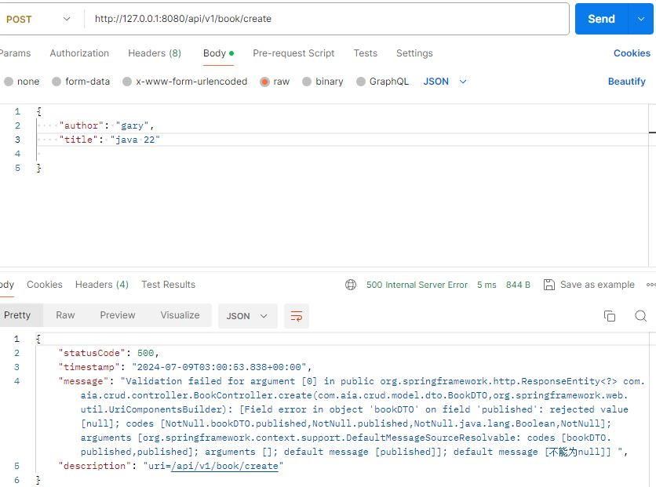
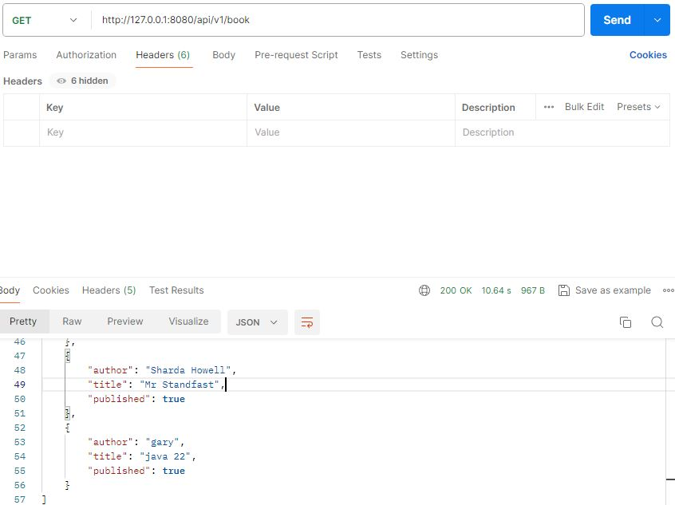
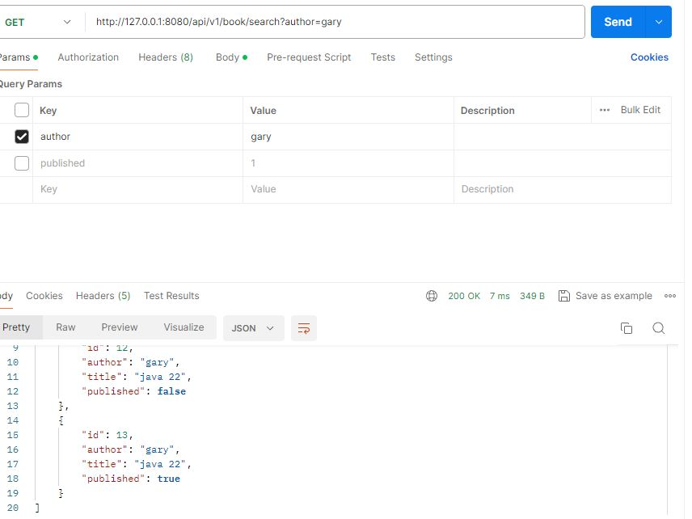
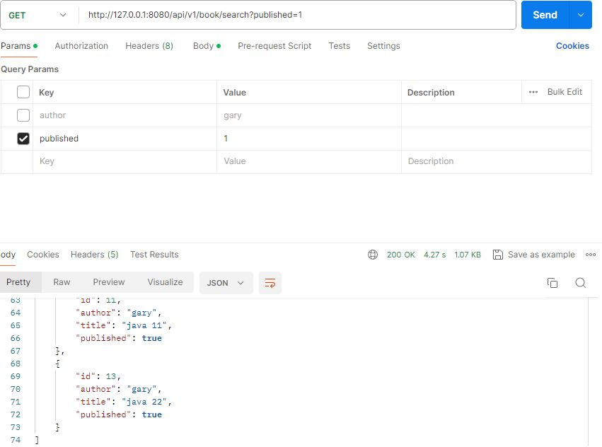
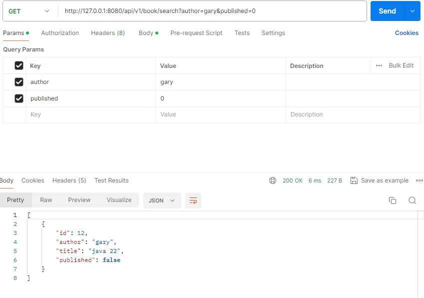
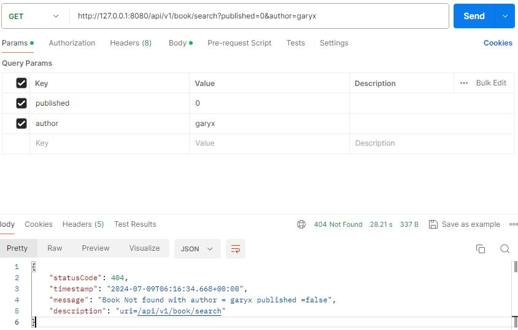
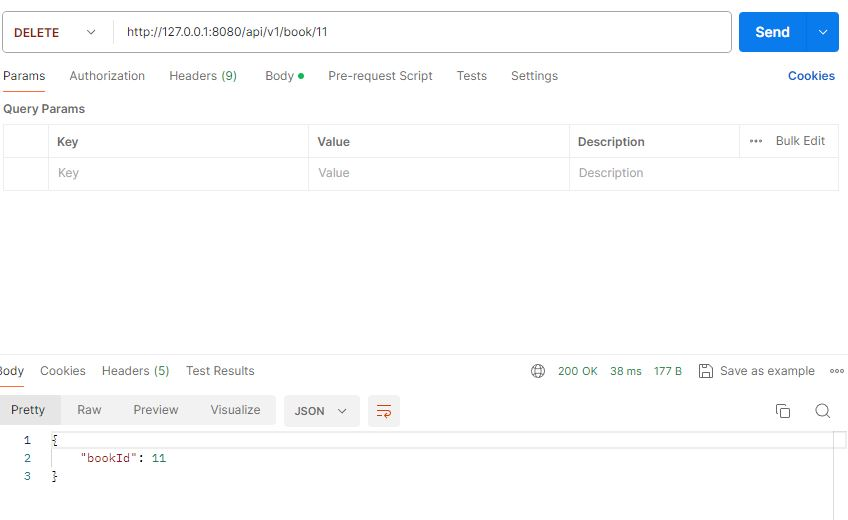
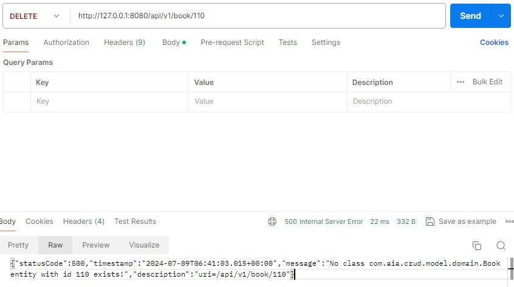

# Spring Boot CRUD Demo 


## Introduction

### The CRUD Application using Spring boot Restful API
This spring boot application is to implement a CRUD (**C**reate, **R**ead and **D**elete) operations for a simple resource. 


## Project Structure

The following are the base folders in which the project is organized and the purpose of each:
- [📁 application](src/main/java/com/aia/crud/application): contains the main class, annotated with `@SpringBootApplication`, which is responsible for booting up the application;
- [📁 builder](src/main/java/com/aia/crud/builder): contains utility class responsible for converting entity to DTO and vice-versa;
- [📁 config](src/main/java/com/aia/crud/config): contain definition of beans through Spring configuration classes annotated with `@Configuration`;
- [📁 controller](src/main/java/com/aia/crud/controller): contain classes annotated with `@Controller` responsible for processing incoming REST API requests;
- [📁 exception](src/main/java/com/aia/crud/exception): contain custom exceptions for handling specific data consistent and business rule violations by @ControllerAdvice;
- [📁 domain](src/main/java/com/aia/crud/model/domain): contain POJO classes annotated with `@Entity` representing database entities;
- [📁 dto](src/main/java/com/aia/crud/model/dto): contain DTO classes which are used as objects that pass through architectural boundaries to transfer data; 
- [📁 repository](src/main/java/com/aia/crud/repository): contain classes annotated with `@Repository` responsible for providing the mechanism for storage, retrieval, search and delete operation on objects usually present in a database;
- [📁 service](src/main/java/com/aia/crud/service): contains class annotated with `@Service` in which business logic is implemented;


## Prerequisites
- Maven 3+
- Java 8+


## Libraries and Dependencies
- [Spring Web](https://docs.spring.io/spring-framework/docs/current/reference/html/web.html)
- [Spring Data JPA](https://spring.io/projects/spring-data-jpa)
- [JUnit 5](https://junit.org/junit5/)
- [Mockito](https://site.mockito.org/)
- [Hamcrest](http://hamcrest.org/)
- [Mysql Database](https://www.mysql.com)
- [Lombok](https://projectlombok.org/)
- [ModelMapper](http://modelmapper.org/)


## The CRUD Project
This project implementes an API to manage book data. An H2 in-memory database can be used for testing, but you can easily set up a real database. For instance, to configure a MySQL database you'd only need to do the following two steps:

1. Add MySQL dependency to [pom.xml](./pom.xml)
````xml
<dependency>
    <groupId>mysql</groupId>
    <artifactId>mysql-connector-java</artifactId>
    <scope>runtime</scope>
</dependency>
````

2. Add MySQL connection properties to [application.yml](./src/main/resources/application.yml)
````yaml
spring:
  datasource:
    driverClassName: com.mysql.jdbc.Driver
    url: jdbc:mysql://127.0.0.1:3306/apps_database?useSSL=false
    username: root
    password: root
  jpa:
    properties:
      hibernate:
        dialect: org.hibernate.dialect.MySQL5InnoDBDialect
    hibernate:
      ddl-auto: update
````

## Booting Up the Application
Use the command line 
<ol>
<li>Clone the repository:</li>
  <code>git clone https://github.com/floydhk/crud-demo</code>
<li>Navigate to the folder:</li>
  <code>cd spring-boot-crud-rest</code>
<li>Run the application:</li>
  <code>mvn spring-boot:run</code>
</ol>


## Restful API specification
#####  1. Creating new Book and save to repository

<details>
 <summary><code>POST</code> <code><b>/create</b></code> <code>(create Book object and save to DB)</code></summary>

###### Parameters

> | name      |  type     | data type               | description                                                           |
> |-----------|-----------|-------------------------|-----------------------------------------------------------------------|
> | None      |  required | request Body (JSON)           | {  "author": "gary",   "title": "java 11","published": 1}  |


###### Responses

> | http code     | content-type                      | response                                                            |
> |---------------|-----------------------------------|---------------------------------------------------------------------|
> | `200`         | `application/json`                  | {"bookId":11}   (Return id if successfully created)                               |
                                                      |
</details>


  
  
  HTTP 200 status is returned on creating the request resource successfully. The book id of the newly created resource is generated on return. 

  
  
  If the required fields are missing in request parameter, an HTTP 500 status is returned with error message contaning the reason of missing field.

 #####  2. Get all Book records from DB

<details>
 <summary><code>GET</code> <code><b>/</b></code> <code>(get all books record from DB)</code></summary>

###### Parameters

> | name      |  type     | data type               | description                                                           |
> |-----------|-----------|-------------------------|-----------------------------------------------------------------------|
> | None      |           |            |    |


###### Responses

> | http code     | content-type                      | response                                                            |
> |---------------|-----------------------------------|---------------------------------------------------------------------|
> | `200`         | `application/json`                  | {{"author":"gary","title":"java 22","published":true}} (Return all books data in JSON format)                               |
> | `404`         | `application/json`                  | (Return Book Not Found error message if no any book in DB)                               |
                                                        |
</details>


  


##### 3. Search books matching search criteria of author and/or published state. 

Note: If either author or published state fields are entered in request parameter, then the books records are returned based on the corresponding field. However, If both fields are entered, then return the book records matching both fields. If no books matching the criteria, the BookNotFound error message is returned.

<details>
 <summary><code>GET</code> <code><b>/</b></code> <code>(get all books record from DB based on either author or published state)</code></summary>

###### Parameters

> | name      |  type     | data type               | description                                                           |
> |-----------|-----------|-------------------------|-----------------------------------------------------------------------|
> | author    | optional      | text                |  (Author name)   |
> | published  | optional      | text                |  (Published state)   |


###### Responses

> | http code     | content-type                      | response                                                            |
> |---------------|-----------------------------------|---------------------------------------------------------------------|
> | `200`         | `application/json`                  | [{"id":11,"author":"gary","title":"java 22","published":true}] (Return all books data matching the above criteria in JSON format)                               |
> | `404`         | `application/json`                  | (Return Book Not Found error message if not matching the above criteria in JSON format)                               |
                                                      |
</details>


   
  
  
  

##### 4. Delete existing book based on the book Id.

<details>
 <summary><code>DELETE</code> <code><b>/{id}</b></code> <code>(delete existing book record based on the book Id)</code></summary>

Note: the book Id is appended at the end of the endpoint as path variable.

######  Parameters

> | name      |  type     | data type               | description                                                           |
> |-----------|-----------|-------------------------|-----------------------------------------------------------------------|
> | none    |       |                 |    |


###### Responses

> | http code     | content-type                      | response                                                            |
> |---------------|-----------------------------------|---------------------------------------------------------------------|
> | `200`         | `application/json`                  |  {"bookId":11}  (Return book Id that has been deleted successfully in JSON format)                               |
> | `500`         | `application/json`                  | {"statusCode":500,"timestamp":"2024-07-09T06:41:03.015+00:00","message":"No class com.aia.crud.model.domain.Book entity with id 110 exists!","description":"uri=/api/v1/book/110"} (Return error message if not matching the book id in JSON format)                               |
                                                      |
</details>

  
  
  The book record is successfully deleted as bookId value is returned in response msg.
  
  
  

  If we try to look up the deleted book by its id we will get an HTTP 500 status code response indicating the reason of failure.

## Unit Test
To test the code for functionalities , JUnit test is employed, some [controller](./src/test/java/com/aia/crud/controller). To execute the tests, from the project root, run:
````bash
$ mvn test
````

